# Lattice Boltzmann Method in C++ and CUDA

Welcome to our cutting-edge implementation of the Lattice Boltzmann Method (LBM), a powerful computational fluid dynamics technique. In this project, we seamlessly blend clarity in CPU code with optimized GPU performance, offering an efficient and versatile solution. Whether you're a developer exploring our object-oriented CPU code for its clarity or delving into the GPU-accelerated calculations for maximum performance, this documentation should provide a comprehensive guide to navigating and understanding our LBM implementation.

Ball, Reynolds 400, Inlet 0.2, Lattice 200x100  |  Lift and Drag
:-------------------------:|:-------------------------:
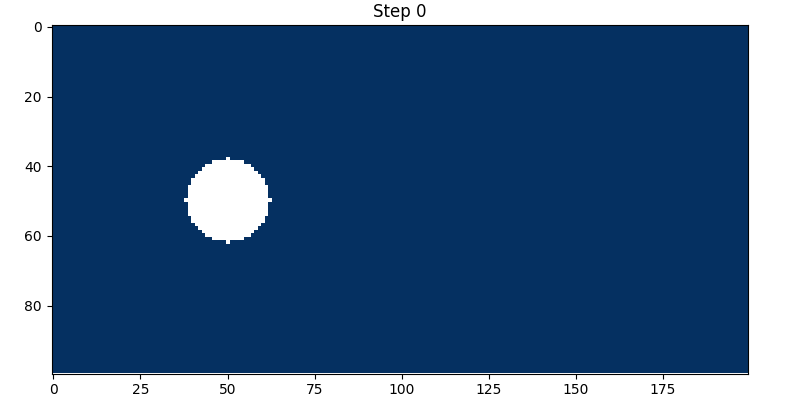 |  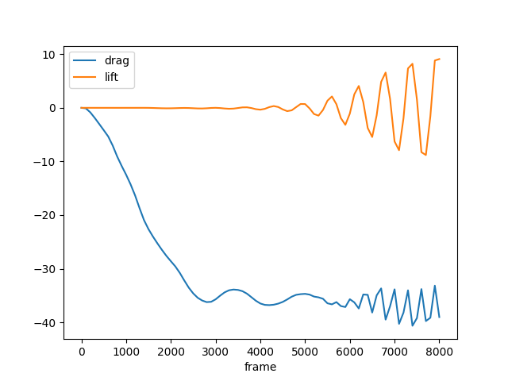

## Building
After cloning the repo, ensure you have the following software installed to run the project:

- **CMake**
- **Make**
- **C++ compiler** (GCC/G++ suggested)
- **Python**
- **imagemagick** (optional, for generating gifs)
- **CUDA Toolkit** (optional, for GPU support)

To install these dependencies on Ubuntu, you can use the following command:

```bash
sudo apt update && sudo apt install -y cmake make g++ python3 python3-venv imagemagick
```

For CUDA Toolkit, follow the installation instructions from the [official NVIDIA website](https://developer.nvidia.com/cuda-downloads).

Create python virtual environment and install requirements

```bash
python3 -m venv env
source env/bin/activate
pip install -r requirements.txt
```

Compile the project

```bash
./compile.sh # Builds in release mode
```

## Running

**You'll find ALL outputs in the `outputs` folder.**

Test run the project

```bash
./run.sh lid-driven-cavity 100
```

Optionally, try running a more complex example on the gpu

```bash
./run.sh ball 100 --gpu
```

To generate an airfoil, run the following command

```bash
python scripts/airfoil_generator.py
```

You can also generate an obstacle of your own, by loading from a png of only black and white pixels

```bash
python scripts/png_reader.py
```

Circular obstacles can be generated with the following command

```bash
python scripts/ball.py
```

## Usage

To understand the usage of the `./run.sh` script, simply execute the following command in your terminal:

```bash
./run.sh
```

The script will display detailed instructions on how to use it, including the required arguments and optional flags. This will help you configure and run simulations tailored to your specific needs.

## A more in depth look at the Lattice Boltzmann Method
The advanced Computational Fluid Dynamics (CFD) method known as the Lattice Boltzmann Method (LBM) is grounded in the principles of particle dynamics and specific space-time discretization techniques. LBM, an accurate mesoscale model, leverages the Kinetic Theory and the Lattice Gas Model to depict fluid behavior by simulating particle movement on a regular lattice. Despite its inherent computational complexity, this model finds widespread application in large-scale simulations.

## Our Implementation
Our model is characterized by a two-dimensional portrayal of fluid dynamics within a lattice. Depending on the nature of the problem at hand, the fluid may either be confined within the lattice or allowed to pass through it. The foundational structure of our code not only facilitates seamless two-dimensional simulations but also sets the stage for future implementations of three-dimensional simulations. This adaptability is made possible through the integration of the `Structure` class and the `NDimensionalMatrix` template class, allowing for modifications in specific methods while preserving the fundamental structures and overall code organization.

## The execution loop
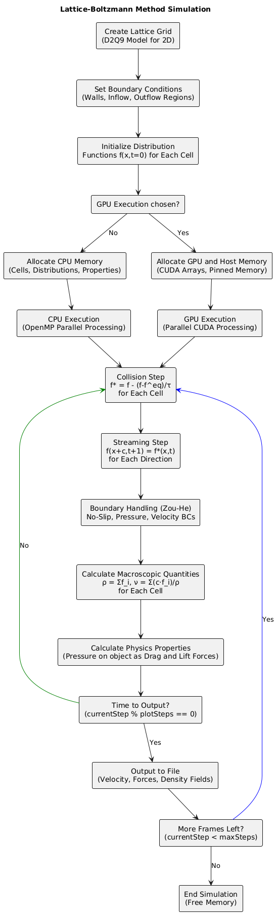

## How different problems are represented
We have developed a system that loads problems from plain text files. Each problem type is denoted by a number, and additional simulation parameters are also specified in the file. Some problem types support arbitrarily shaped obstacles in the lattice, and the shapes of those are also outlined in the text file.

## Separable compilation
The CMakeLists file is designed to cater to a broad range of systems. Computers with the CUDA toolkit installed will compile the executable with CUDA support, while those without the CUDA toolkit will still compile but lack support for GPU execution.

## Code Design Choices
We have chosen to use the **D2Q9 velocity set** along with their respective weights as the discretization of the velocity field to describe the possible movements of particles within the lattice. This choice strikes a balance between accuracy and computational efficiency, with the nine velocity directions proving effective in capturing a wide range of fluid dynamic phenomena in two dimensions, including vortical flows and other complex behaviors.

For managing interactions among fluid particles within our discretized environment, we've implemented the **Two-Relaxation-Time (TRT)** model. This model employs two distinct relaxation times, tailored for different components of the particle distribution function. The use of TRT effectively addresses limitations present in alternative models, offering enhanced flexibility, consistency, and accuracy in describing a wide array of fluid dynamic phenomena.

We have selected the **Zou-He boundary conditions** to govern the interaction between fluid particles and solid surfaces in our implementation. These conditions facilitate an efficient and accurate representation of the no-slip condition, assuming that the fluid velocity at the surface contact equals the velocity of the surface itself. The Zou-He conditions play a crucial role in calculating the unknown particle distributions in cells adjacent to the domain boundary. By enforcing the bounce-back rule for the non-equilibrium part of particles, these conditions ensure the correct reflection of particles, contributing to the overall fidelity of our simulations.

The conditions governing the behavior of the fluid in contact with an obstacle employ the **non-interpolated bounce-back** method.

We opted for the **regular bounce-back** method for handling obstacles instead of the interpolated version. This choice allows us to achieve a sufficiently accurate simulation with a significantly simpler code structure and higher performance.

In terms of **conventions for x and y coordinates** representing lattice cell positions, we adopted an approach aligned with matrix indexing. Specifically, an increase in the x coordinate signifies movement to the right, while an increase in the y coordinate corresponds to downward movement.

When organizing data in a memory data structure, we chose **row-major** order. In C++, sequential access to a matrix in row-major order is often more efficient. This decision aligns with how memory is loaded and managed in the processor cache during program execution.

The prevalence of **object-oriented programming** led us to adopt this approach over other contemporary methodologies, such as functional programming. This decision is grounded in the understanding that the primary performance gains come from the GPU. The primary objective of the CPU code is clarity and conciseness rather than aggressively optimizing for every last bit of available performance.


## Lift and Drag
Lift and Drag forces are essential for understanding the behavior of a moving fluid and are particularly relevant in evaluating specific sections of a project, such as vehicles, airplanes, and marine structures.

The **Momentum Exchange Method**, at the core of the implementation, manages microscopic interactions in fluids. After the collision phase of particles, momentum exchange occurs between adjacent cells, allowing the LBM to accurately model complex flows, velocity gradients, and non-stationary flows.

For a parabolic setInlets configuration, we anticipate a monotonic behavior in the lift and drag graphs, barring the presence of significant turbulence. The parabolic setInlets should lead to a predictable and smoothly varying flow, resulting in **gradual changes in lift and drag forces**. Any deviations from monotonic behavior may indicate the influence of turbulent phenomena within the simulated fluid.

## Memory Layout
The CPU code is structured as an **Array of Structures**, following an object-oriented paradigm, facilitating a clear code structure and a seamless implementation. On the other hand, the GPU code utilizes a **Structure of Arrays** data structure, optimizing for maximum performance through memory coalescence. This approach capitalizes on the GPU memory bus width, reducing the overall number of data requests when multiple threads require neighboring data.

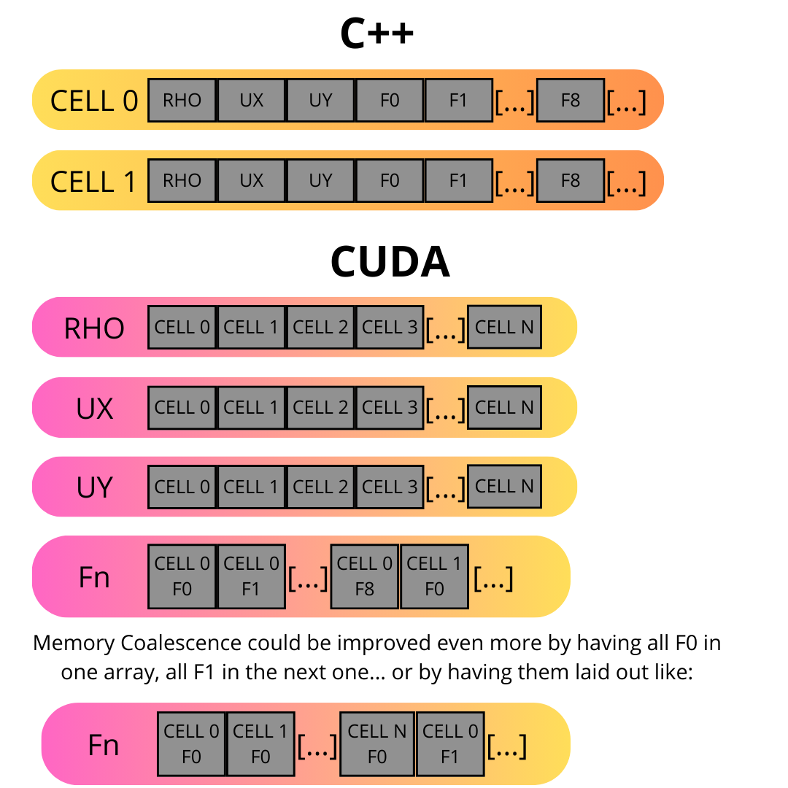

## Input Files
The requisite information within these text files includes:
- The problem type (1 for the lid-driven cavity, 2 for parabolic inlet / poiseuille flow)
- The width and height of the lattice
- Parameters such as the Reynolds number, total number of steps, and maximum forced velocity
- For problem type 2, a list of coordinates representing cells designated as obstacles

Furthermore, our program supports a problem type 3, facilitating the *inaccurate* simulation of a ball oscillating up and down.

## Output Files
The program generates output files within the `outputs` folder, with the output displayed every *total steps / frames* steps, where frames is a user-specified parameter from the command line.

- **velocity_out.txt**: This file contains the velocity field at each time step.
- **lift_drag_out.txt**: It includes the drag and lift forces at each time step.

The program also produces png and gif visualization files.

## Parallelization
Parallelizing this project is particularly convenient due to the inherent nature of the Lattice Boltzmann Method, where each cell in the lattice performs identical computations independently of others. This uniformity allows for straightforward distribution of tasks across multiple threads or GPU cores, maximizing computational efficiency and scalability.

Parallelization is achieved through both OpenMP and CUDA, utilizing multiple threads on the CPU and the parallel architecture of the GPU, respectively. The OpenMP implementation employs the `#pragma omp parallel for` directive, automatically distributing the workload among available threads. The CUDA implementation utilizes a 2D grid of blocks, where each block contains a grid of 24x24 threads. The number of blocks is determined by the lattice size. Implementing OpenMP involves minimal code changes, allowing seamless execution with or without OpenMP support.

## Atomic Operations for Lift and Drag
The use of `#pragma omp atomic` directive and `atomicAdd` CUDA function is pivotal during force updates to guarantee the consistency and correctness of results in parallel environments. By enforcing atomic operations, this directive prevents write concurrency issues, preserving the integrity of the results.

## Performance Analysis

CPU Utilization

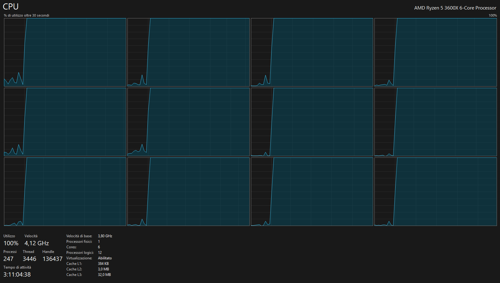

Callgrind Analysis

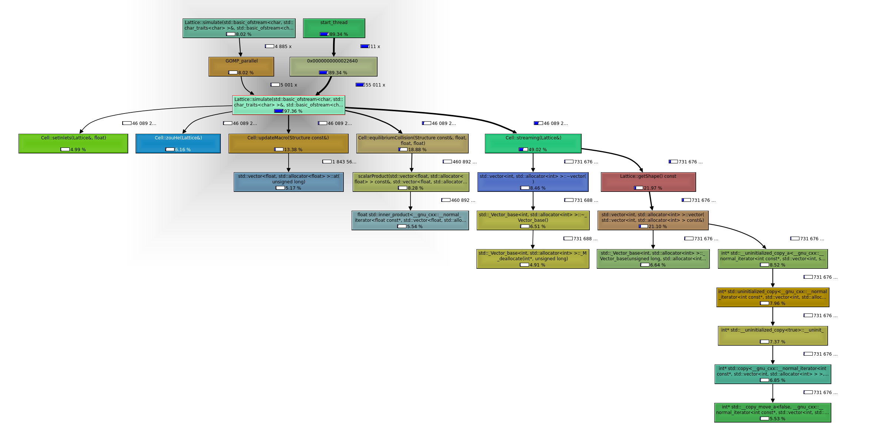

GPU Profiling with Nvidia Nsight Systems: initial memory allocation

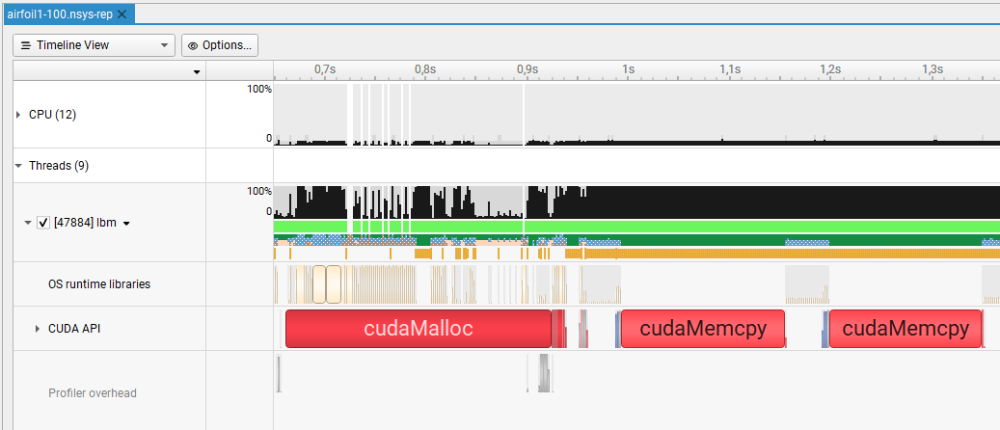

Kernels execution detail

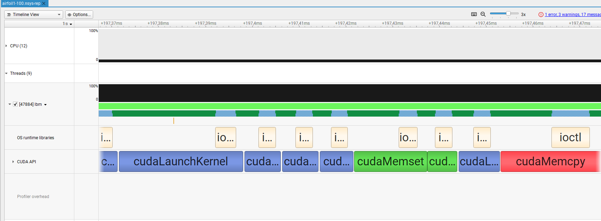

### Observations
The CPU efficiently utilizes every available core, operating at maximum capacity (100%). Notably, there is no significant time consumed by malloc/free functions, since data is never copied unless necessary. Execution time is uniformly distributed among the various functions involved in executing a simulation step.

In terms of GPU performance, clear bottlenecks emerge, primarily attributable to disk speed despite the usage of a high-speed modern SSD. Additionally, the link speed between RAM and VRAM presents a noticeable constraint.

# Other Examples
Airfoil 01, Reynolds 180, Inlet 0.17, Lattice 400x150 |  Lift and Drag
:-------------------------:|:-------------------------:
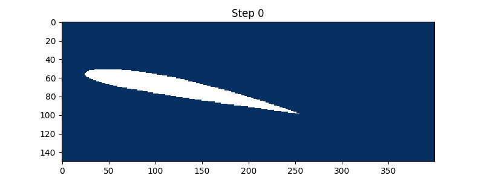 | 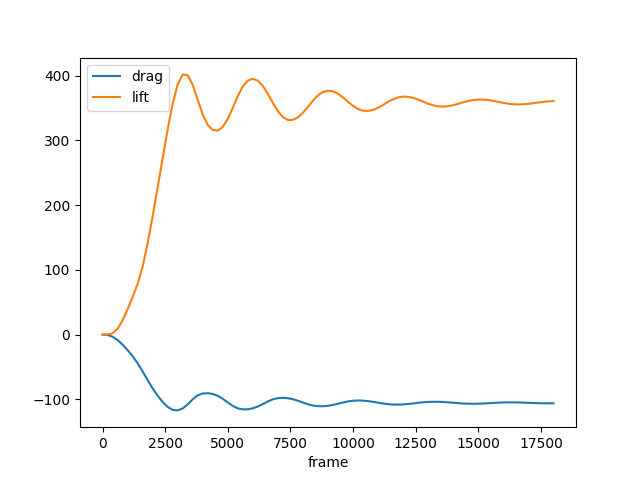

Airfoil 02, Reynolds 500, Inlet 0.2, Lattice 900x300  |  Lift and Drag
:-------------------------:|:-------------------------:
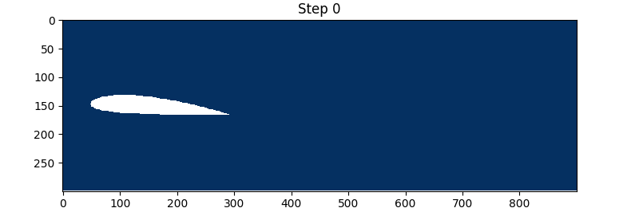 | 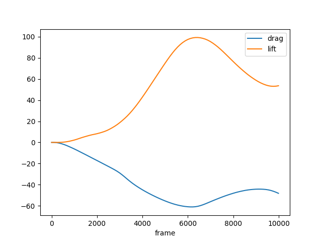

Lid Driven Cavity, Reynolds 1000, Inlet 0.2, Lattice 96x96, with motion vectors | Moving Ball, Reynolds 300, Inlet 0.18, Lattice 120x120 (Inaccurate Simulation)
:-------------------------:|:-------------------------:
 | 

Me, Reynolds 600, Inlet 0.03, Lattice 200x300


## Contributions
- [Andrea Torti](https://github.com/AndreaTorti-01)
- [Martina Raffaelli](https://github.com/martinaraffaelli)
- [Marco Cioci](https://github.com/MarcoCioci)

## Credits
This project takes inspiration from [jviquerat's lbm python code](https://github.com/jviquerat/lbm)
